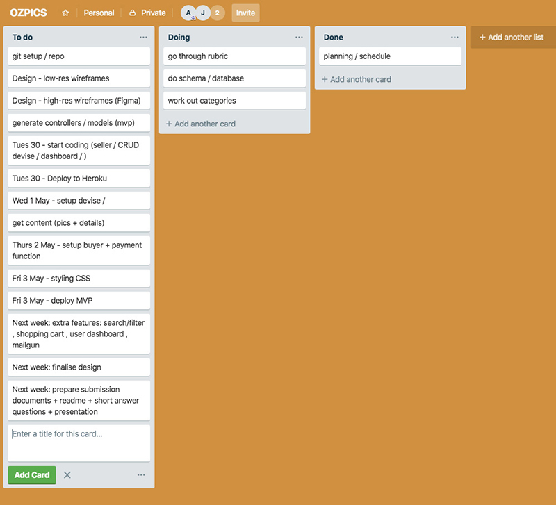
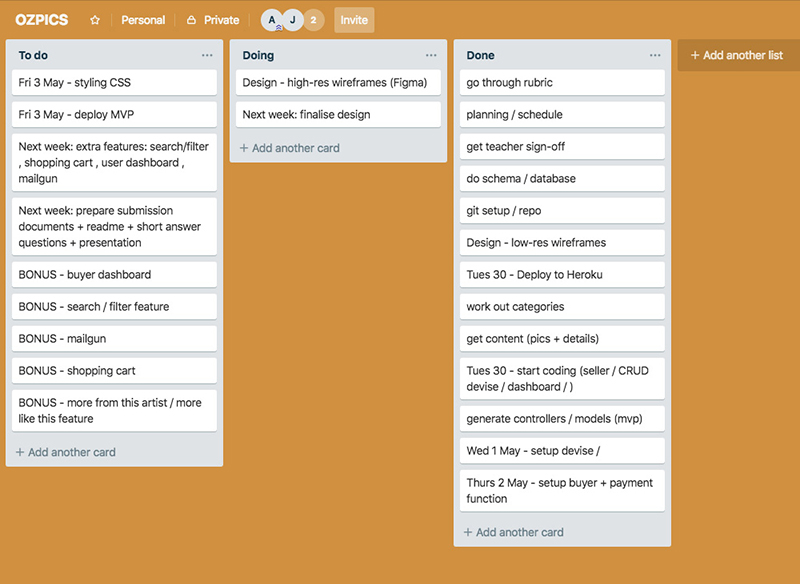
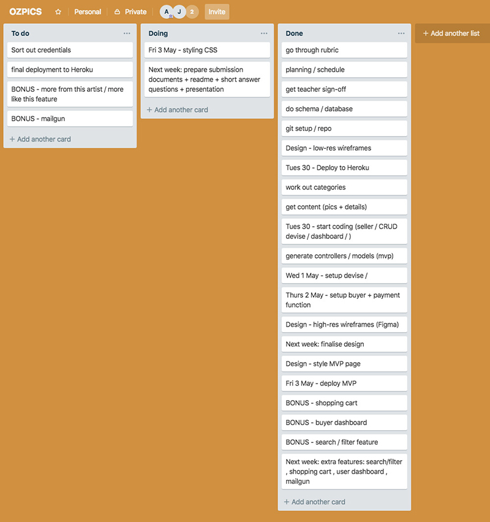
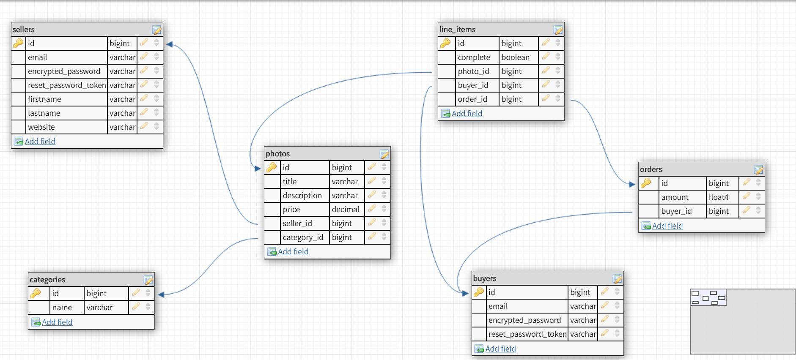

# README
# link (URL) to the App
https://sleepy-mountain-74358.herokuapp.com/

# GitHub repository link
https://github.com/annarosz/ozpics

# Project Description

### Project purpose
  The purpose of this project is to create a two side market place where people can go to sell or buy photos. 
### Functionality / features
  - Buyer function
    - sign up
    - log in
    - view dashboard of order history
    - add a photo to cart, checkout and view order
  - Seller function
    - sign up
    - log in
    - view dashboard of own profile and photos
    - create, edit and delete own photos
### Screenshots
(TBC)
### Tech stack
  - HTML5
  - CSS & Bootstrap
  - Ruby on Rails
  - Heroku
  - Github
### Instructions
  - Join as a seller
    - create an account as a seller / or login if have an account
    - under "My Account" go to dashboard to add photos
    - click the single photo to edit or delete
    - to edit account or log out, go to link under "My Account"
  - Join as a buyer
    - create an account as a buyer / or login if have an account
    - click to view a photo
    - click "Add to Cart" to add the photo to shopping cart
    - after selecting all wanted photos, click checkout
    - finalise payment by fill credit card details
    - view this order by click "View Order" button
    - under "My Account" go to dashboard to view order history
    - to edit account or log out, go to link under "My Account"
# Design Documentation

### Design process

(TBC)

### User stories

see short answer questions #15

### A workflow diagram of the user journey/s.

(TBC)

### Wireframes

see short answer questions #16

### Database Entity Relationship Diagrams

  see short answer questions #14

# Planning Process

### Project plan & timeline
  - week 1 
    - day1: planning(low-res wireframe, trello), database design, set up Github
    - day2: create seller function, prepare website contents
    - day3: continue work on seller function(divise to set up login, aws to upload image) sigma page mockups
    - day4: work on buyer function (stripe), start styling
    - day5: achieve project mvp
  - week 2
    - work on extra features: shopping cart, order history, category filter, search function.
    - keep working on styling
    - prepare documentation for submission
    - prepare presentation
### Screenshots of Trello board

# Short Answer Questions
#### 1. What is the need (i.e. challenge) that you will be addressing in your project?

The challenge is to provide a secure and functional platform that people can use to trade. The platform is serving as a market place where a photographer can sell their photos and people such as graphic designer can purchase it. It has to be secure in terms of functons such as only seller can edit and delete their own stock. On the other hand the buyers can make payment safely through Stripe. In terms of functionality, the challenge is to have the user to create their accounts. The sellers are able to publish photos and the buyer are able to add the photo to a shopping cart and view their purchasing history.   

#### 2. Identify the problem you’re trying to solve by building this particular marketplace App? Why is it a problem that needs solving?

anna

#### 3. Describe the project will you be conducting and how your App will address the needs.

#### 4. Describe the network infrastructure the App may be based on.

https://en.wikipedia.org/wiki/Heroku

#### 5. Identify and describe the software to be used in your App.

We use Stripe to handle online payment which allow buyers and sellers to make and receive payments over the Internet

#### 6. Identify the database to be used in your App and provide a justification for your choice.

#### 7. Identify and describe the production database setup (i.e. postgres instance).

#### 8. Describe the architecture of your App.

anna

#### 9. Explain the different high-level components (abstractions) in your App.

#### 10. Detail any third party services that your App will use.

Third party services includes
  - Amazon Simple Storage Service (S3) for photo uploading
  - Stripe API for payment
  - Heroku for App deploying

#### 11. Describe (in general terms) the data structure of marketplace apps that are similar to your own (e.g. eBay, Airbnb).

Amazon is a marketplace where buyers and sellers used to trade. The data structure of Amazon is ???

#### 12. Discuss the database relations to be implemented.

one to many relations
  - a seller has many photos
  - a category has many photos
  - a buyer has many orders

many to many relations
  - an order has many photos, a photo belongs to many orders

#### 13. Describe your project’s models in terms of the relationships (active record associations) they have with each other.

#### 14. Provide your database schema design.

#### 15. Provide User stories for your App.

(TBC)

#### 16. Provide Wireframes for your App.

(TBC)

#### 17. Describe the way tasks are allocated and tracked in your project.

Tasks are divided into two parts for this project, front end of design and styling, backend of functions and features. 

#### 18. Discuss how Agile methodology is being implemented in your project.

We have a moring stand up session where we talk about what has been done and the difficulties we faced the day before. We also need to talk about what are going to be done on the day. Advice and help can be obtained during this process in terms of solving the problems that we are having.

#### 19. Provide an overview and description of your Source control process.

We are using Github to track and manage any code changes of the project. Everytime we create a contrller or a model we make a commit and push to Github. At the end of the day, one of the team member will pull the latest Github master code to her local laptop. From their conflicts will be solved locally with her changes of code. After solving the conflicts, codes will be push back to Github. From there the other team member can do a git pull to update her local codes.

#### 20. Provide an overview and description of your Testing process.

#### 21. Discuss and analyse requirements related to information system security.

#### 22. Discuss methods you will use to protect information and data.

#### 23. Research what your legal obligations are in relation to handling user data.

